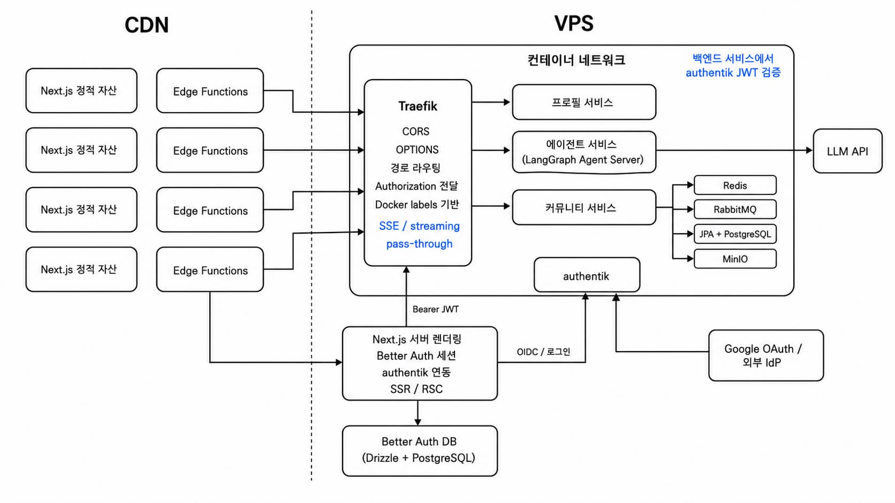

# 프로젝트 설명

better-auth를 이용한 JWT 발급 및 nginx를 이용한 MSA 프로젝트입니다.

## 실행법

- Docker 의 Deamon 이 설치되어 있어야 합니다.
- node, npm, python, uv가 설치되어 있어야 하며 java 21로 설정되어 있어야 합니다.
- `.env.example`을 참고하여 프로젝트 루트에서 make dev를 실행하면 compose가 빌드되고 localhost:3000으로 next.js의 클라이언트가 실행됩니다.

## MSA 기능 설명

- **프론트엔드**
  - 프론트엔드 next.js의 라우트핸들러에서 better-auth를 통해 JWT 토큰을 발급하고, 클라이언트 요청을 프록시합니다.
  - orval을 통해 zod, react suspense query 등을 swagger와 연동하여 생성합니다.
- **frontend\orval.config.ts. backend\nginx, docker-compose.yml, Makefile**
  - MSA 아키텍처 구성을 위해 필요한 빌드 설정들입니다. 엔진엑스를 띄워야 아키텍처가 정상동작하므로 신규 서비스를 등록해주어야 합니다.
- backend\services\echo-service : nginx 내부에서 다른 서비스를 호출하는 예시가 포함되어 있습니다.
- **backend\services\community-service**
  - JWT 토큰을 소비하여 유저 테이블에 새로운 유저 데이터를 삽입하는 예시, JWT를 통한 인가로 CRUD하는 예시가 포함되어 있습니다.
  - REDIS를 이용한 캐싱과 RabbitMQ를 이용한 비동기 작업이 포함되어 있습니다.

보다 자세한 설명은 docs\architectur-review-by-gpt-5-5.md 를 참고하세요.

## 에이전트
